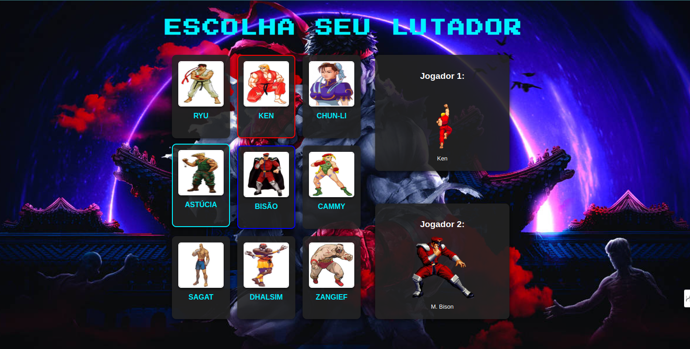

# 🎮 Projeto Street Fighter Web 🎮



## 📋 Descrição

Este projeto é uma homenagem aos clássicos dos videogames, recriado utilizando apenas **HTML**, **CSS** e **JavaScript** puro!  
Inspirado no icônico **Street Fighter**, o objetivo foi trazer a energia vibrante dos jogos de luta para o mundo da web.

## 🚀 Tecnologias Utilizadas

- HTML5
- CSS3
- JavaScript (Vanilla)

## 🎨 Funcionalidades

- Layout inspirado em jogos clássicos
- Fonte de impacto semelhante ao estilo Street Fighter
- Responsividade para diferentes tamanhos de tela
- Estrutura simples e eficiente para prática de front-end

## 📷 Prévia do Projeto


## 🛠️ Como Rodar o Projeto

1. Clone o repositório:
   ```bash
   git clone https://github.com/seu-usuario/seu-repositorio.git

Acesse a pasta do projeto:

cd seu-repositorio


    Abra o arquivo index.html no navegador.

Pronto! Você verá a homenagem aos clássicos diretamente no seu navegador! 🎮
📬 Contato

Se quiser trocar ideias sobre desenvolvimento web ou projetos criativos:

    LinkedIn: https://www.linkedin.com/in/j%C3%B4natas-emanuel-1049b8b9/

    E-mail: jonatasemanuel@gmail.com

⭐️ Se você gostou do projeto, deixe uma estrela no repositório!

#StreetFighter #WebDevelopment #HTML #CSS #JavaScript #ProjetoPessoal #RetroGaming #FrontEnd


---

